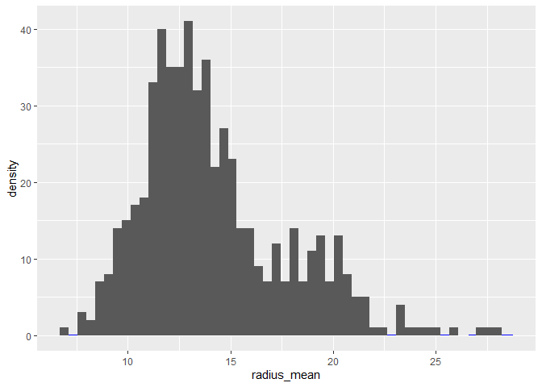
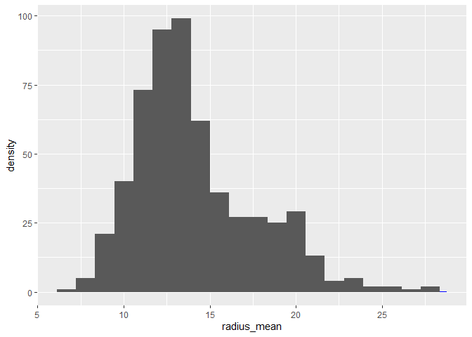
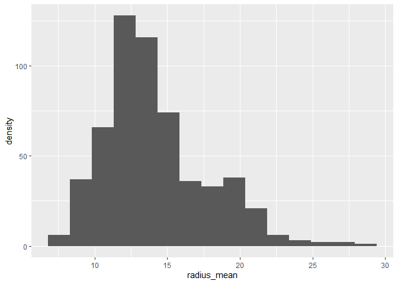
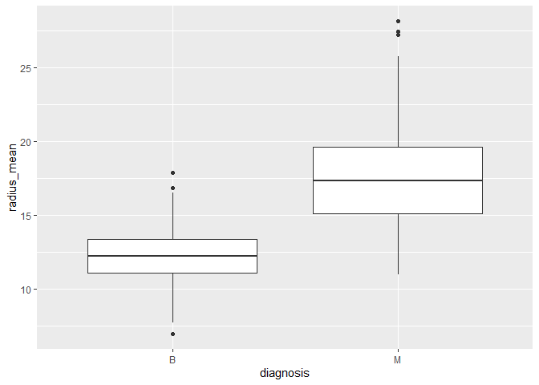
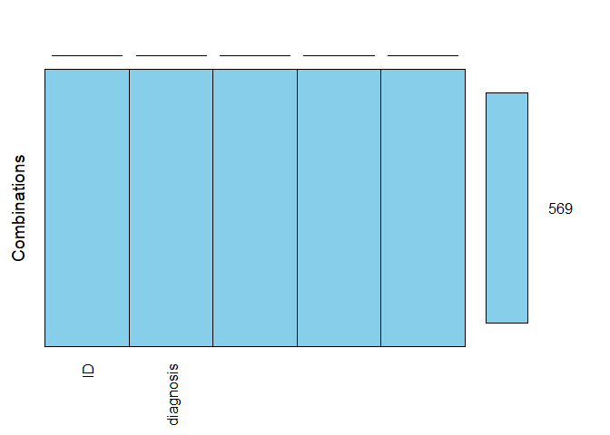
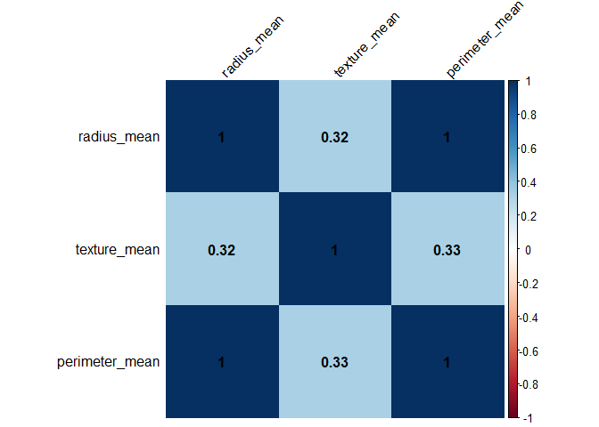
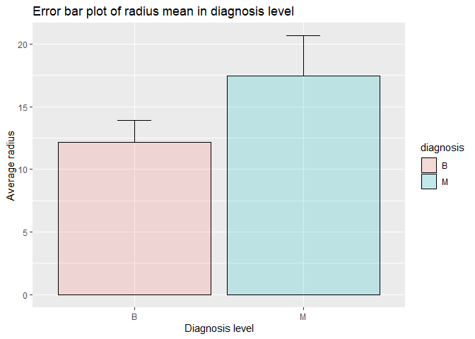
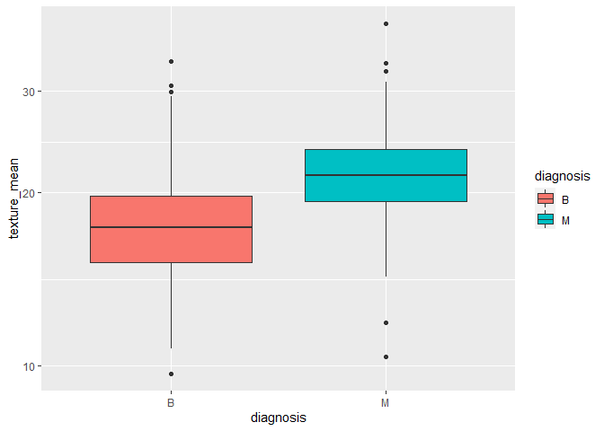
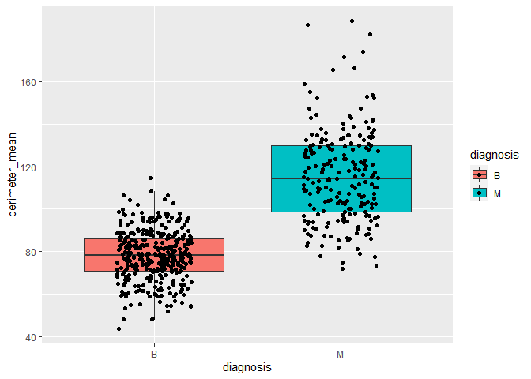

Mini Data-Analysis Deliverable 1
================

# Welcome to your (maybe) first-ever data analysis project!

And hopefully the first of many. Let’s get started:

1.  Install the [`datateachr`](https://github.com/UBC-MDS/datateachr)
    package by typing the following into your **R terminal**:

<!-- -->

    install.packages("devtools")
    devtools::install_github("UBC-MDS/datateachr")

2.  Load the packages below.

``` r
library(datateachr)
library(tidyverse)
```

3.  Make a repository in the <https://github.com/stat545ubc-2022>
    Organization. You will be working with this repository for the
    entire data analysis project. You can either make it public, or make
    it private and add the TA’s and Lucy as collaborators. A link to
    help you create a private repository is available on the
    #collaborative-project Slack channel.

# Instructions

## For Both Milestones

-   Each milestone is worth 45 points. The number of points allocated to
    each task will be annotated within each deliverable. Tasks that are
    more challenging will often be allocated more points.

-   10 points will be allocated to the reproducibility, cleanliness, and
    coherence of the overall analysis. While the two milestones will be
    submitted as independent deliverables, the analysis itself is a
    continuum - think of it as two chapters to a story. Each chapter, or
    in this case, portion of your analysis, should be easily followed
    through by someone unfamiliar with the content.
    [Here](https://swcarpentry.github.io/r-novice-inflammation/06-best-practices-R/)
    is a good resource for what constitutes “good code”. Learning good
    coding practices early in your career will save you hassle later on!

## For Milestone 1

**To complete this milestone**, edit [this very `.Rmd`
file](https://raw.githubusercontent.com/UBC-STAT/stat545.stat.ubc.ca/master/content/mini-project/mini-project-1.Rmd)
directly. Fill in the sections that are tagged with
`<!--- start your work below --->`.

**To submit this milestone**, make sure to knit this `.Rmd` file to an
`.md` file by changing the YAML output settings from
`output: html_document` to `output: github_document`. Commit and push
all of your work to the mini-analysis GitHub repository you made
earlier, and tag a release on GitHub. Then, submit a link to your tagged
release on canvas.

**Points**: This milestone is worth 45 points: 43 for your analysis, 1
point for having your Milestone 1 document knit error-free, and 1 point
for tagging your release on Github.

# Learning Objectives

By the end of this milestone, you should:

-   Become familiar with your dataset of choosing
-   Select 4 questions that you would like to answer with your data
-   Generate a reproducible and clear report using R Markdown
-   Become familiar with manipulating and summarizing your data in
    tibbles using `dplyr`, with a research question in mind.

# Task 1: Choose your favorite dataset (10 points)

The `datateachr` package by Hayley Boyce and Jordan Bourak currently
composed of 7 semi-tidy datasets for educational purposes. Here is a
brief description of each dataset:

-   *apt_buildings*: Acquired courtesy of The City of Toronto’s Open
    Data Portal. It currently has 3455 rows and 37 columns.

-   *building_permits*: Acquired courtesy of The City of Vancouver’s
    Open Data Portal. It currently has 20680 rows and 14 columns.

-   *cancer_sample*: Acquired courtesy of UCI Machine Learning
    Repository. It currently has 569 rows and 32 columns.

-   *flow_sample*: Acquired courtesy of The Government of Canada’s
    Historical Hydrometric Database. It currently has 218 rows and 7
    columns.

-   *parking_meters*: Acquired courtesy of The City of Vancouver’s Open
    Data Portal. It currently has 10032 rows and 22 columns.

-   *steam_games*: Acquired courtesy of Kaggle. It currently has 40833
    rows and 21 columns.

-   *vancouver_trees*: Acquired courtesy of The City of Vancouver’s Open
    Data Portal. It currently has 146611 rows and 20 columns.

**Things to keep in mind**

-   We hope that this project will serve as practice for carrying our
    your own *independent* data analysis. Remember to comment your code,
    be explicit about what you are doing, and write notes in this
    markdown document when you feel that context is required. As you
    advance in the project, prompts and hints to do this will be
    diminished - it’ll be up to you!

-   Before choosing a dataset, you should always keep in mind **your
    goal**, or in other ways, *what you wish to achieve with this data*.
    This mini data-analysis project focuses on *data wrangling*,
    *tidying*, and *visualization*. In short, it’s a way for you to get
    your feet wet with exploring data on your own.

And that is exactly the first thing that you will do!

1.1 Out of the 7 datasets available in the `datateachr` package, choose
**4** that appeal to you based on their description. Write your choices
below:

<!-------------------------- Start your work below ---------------------------->

1.  cancer_sample
2.  flow_sample
3.  parking_meters
4.  vancouver_trees

<!----------------------------------------------------------------------------->

1.2 One way to narrowing down your selection is to *explore* the
datasets. Use your knowledge of dplyr to find out at least *3*
attributes about each of these datasets (an attribute is something such
as number of rows, variables, class type…). The goal here is to have an
idea of *what the data looks like*.

<!-------------------------- Start your work below ---------------------------->

``` r
cancer_sample %>% glimpse() # print the data dimension and variables' type
```

    ## Rows: 569
    ## Columns: 32
    ## $ ID                      <dbl> 842302, 842517, 84300903, 84348301, 84358402, …
    ## $ diagnosis               <chr> "M", "M", "M", "M", "M", "M", "M", "M", "M", "…
    ## $ radius_mean             <dbl> 17.990, 20.570, 19.690, 11.420, 20.290, 12.450…
    ## $ texture_mean            <dbl> 10.38, 17.77, 21.25, 20.38, 14.34, 15.70, 19.9…
    ## $ perimeter_mean          <dbl> 122.80, 132.90, 130.00, 77.58, 135.10, 82.57, …
    ## $ area_mean               <dbl> 1001.0, 1326.0, 1203.0, 386.1, 1297.0, 477.1, …
    ## $ smoothness_mean         <dbl> 0.11840, 0.08474, 0.10960, 0.14250, 0.10030, 0…
    ## $ compactness_mean        <dbl> 0.27760, 0.07864, 0.15990, 0.28390, 0.13280, 0…
    ## $ concavity_mean          <dbl> 0.30010, 0.08690, 0.19740, 0.24140, 0.19800, 0…
    ## $ concave_points_mean     <dbl> 0.14710, 0.07017, 0.12790, 0.10520, 0.10430, 0…
    ## $ symmetry_mean           <dbl> 0.2419, 0.1812, 0.2069, 0.2597, 0.1809, 0.2087…
    ## $ fractal_dimension_mean  <dbl> 0.07871, 0.05667, 0.05999, 0.09744, 0.05883, 0…
    ## $ radius_se               <dbl> 1.0950, 0.5435, 0.7456, 0.4956, 0.7572, 0.3345…
    ## $ texture_se              <dbl> 0.9053, 0.7339, 0.7869, 1.1560, 0.7813, 0.8902…
    ## $ perimeter_se            <dbl> 8.589, 3.398, 4.585, 3.445, 5.438, 2.217, 3.18…
    ## $ area_se                 <dbl> 153.40, 74.08, 94.03, 27.23, 94.44, 27.19, 53.…
    ## $ smoothness_se           <dbl> 0.006399, 0.005225, 0.006150, 0.009110, 0.0114…
    ## $ compactness_se          <dbl> 0.049040, 0.013080, 0.040060, 0.074580, 0.0246…
    ## $ concavity_se            <dbl> 0.05373, 0.01860, 0.03832, 0.05661, 0.05688, 0…
    ## $ concave_points_se       <dbl> 0.015870, 0.013400, 0.020580, 0.018670, 0.0188…
    ## $ symmetry_se             <dbl> 0.03003, 0.01389, 0.02250, 0.05963, 0.01756, 0…
    ## $ fractal_dimension_se    <dbl> 0.006193, 0.003532, 0.004571, 0.009208, 0.0051…
    ## $ radius_worst            <dbl> 25.38, 24.99, 23.57, 14.91, 22.54, 15.47, 22.8…
    ## $ texture_worst           <dbl> 17.33, 23.41, 25.53, 26.50, 16.67, 23.75, 27.6…
    ## $ perimeter_worst         <dbl> 184.60, 158.80, 152.50, 98.87, 152.20, 103.40,…
    ## $ area_worst              <dbl> 2019.0, 1956.0, 1709.0, 567.7, 1575.0, 741.6, …
    ## $ smoothness_worst        <dbl> 0.1622, 0.1238, 0.1444, 0.2098, 0.1374, 0.1791…
    ## $ compactness_worst       <dbl> 0.6656, 0.1866, 0.4245, 0.8663, 0.2050, 0.5249…
    ## $ concavity_worst         <dbl> 0.71190, 0.24160, 0.45040, 0.68690, 0.40000, 0…
    ## $ concave_points_worst    <dbl> 0.26540, 0.18600, 0.24300, 0.25750, 0.16250, 0…
    ## $ symmetry_worst          <dbl> 0.4601, 0.2750, 0.3613, 0.6638, 0.2364, 0.3985…
    ## $ fractal_dimension_worst <dbl> 0.11890, 0.08902, 0.08758, 0.17300, 0.07678, 0…

``` r
is_tibble(cancer_sample) # checking the data format
```

    ## [1] TRUE

The **cancer_sample** has one binary variable “diagnosis” and remaining
31 variables including different features of images of breast masses
biopsy from 569 patients.

``` r
flow_sample %>% glimpse() # print the data dimension and variables' type
```

    ## Rows: 218
    ## Columns: 7
    ## $ station_id   <chr> "05BB001", "05BB001", "05BB001", "05BB001", "05BB001", "0…
    ## $ year         <dbl> 1909, 1910, 1911, 1912, 1913, 1914, 1915, 1916, 1917, 191…
    ## $ extreme_type <chr> "maximum", "maximum", "maximum", "maximum", "maximum", "m…
    ## $ month        <dbl> 7, 6, 6, 8, 6, 6, 6, 6, 6, 6, 6, 7, 6, 6, 6, 7, 5, 7, 6, …
    ## $ day          <dbl> 7, 12, 14, 25, 11, 18, 27, 20, 17, 15, 22, 3, 9, 5, 14, 5…
    ## $ flow         <dbl> 314, 230, 264, 174, 232, 214, 236, 309, 174, 345, 185, 24…
    ## $ sym          <chr> NA, NA, NA, NA, NA, NA, NA, NA, NA, NA, NA, NA, NA, NA, N…

``` r
is_tibble(flow_sample) # checking the data type
```

    ## [1] TRUE

The **flow_sample** contains flow rate in Alberta, Canada. It has 218
observations on 7 different variables including station id, date, flow
rate etc.

``` r
parking_meters %>% glimpse() # print the data dimension and variables' type
```

    ## Rows: 10,032
    ## Columns: 22
    ## $ meter_head     <chr> "Twin", "Pay Station", "Twin", "Single", "Twin", "Twin"…
    ## $ r_mf_9a_6p     <chr> "$2.00", "$1.00", "$1.00", "$1.00", "$2.00", "$2.00", "…
    ## $ r_mf_6p_10     <chr> "$4.00", "$1.00", "$1.00", "$1.00", "$1.00", "$1.00", "…
    ## $ r_sa_9a_6p     <chr> "$2.00", "$1.00", "$1.00", "$1.00", "$2.00", "$2.00", "…
    ## $ r_sa_6p_10     <chr> "$4.00", "$1.00", "$1.00", "$1.00", "$1.00", "$1.00", "…
    ## $ r_su_9a_6p     <chr> "$2.00", "$1.00", "$1.00", "$1.00", "$2.00", "$2.00", "…
    ## $ r_su_6p_10     <chr> "$4.00", "$1.00", "$1.00", "$1.00", "$1.00", "$1.00", "…
    ## $ rate_misc      <chr> NA, "$ .50", NA, NA, NA, NA, NA, NA, NA, NA, NA, NA, NA…
    ## $ time_in_effect <chr> "METER IN EFFECT: 9:00 AM TO 10:00 PM", "METER IN EFFEC…
    ## $ t_mf_9a_6p     <chr> "2 Hr", "10 Hrs", "2 Hr", "2 Hr", "2 Hr", "3 Hr", "2 Hr…
    ## $ t_mf_6p_10     <chr> "4 Hr", "10 Hrs", "4 Hr", "4 Hr", "4 Hr", "4 Hr", "4 Hr…
    ## $ t_sa_9a_6p     <chr> "2 Hr", "10 Hrs", "2 Hr", "2 Hr", "2 Hr", "3 Hr", "2 Hr…
    ## $ t_sa_6p_10     <chr> "4 Hr", "10 Hrs", "4 Hr", "4 Hr", "4 Hr", "4 Hr", "4 Hr…
    ## $ t_su_9a_6p     <chr> "2 Hr", "10 Hrs", "2 Hr", "2 Hr", "2 Hr", "3 Hr", "2 Hr…
    ## $ t_su_6p_10     <chr> "4 Hr", "10 Hrs", "4 Hr", "4 Hr", "4 Hr", "4 Hr", "4 Hr…
    ## $ time_misc      <chr> NA, "No Time Limit", NA, NA, NA, NA, NA, NA, NA, NA, NA…
    ## $ credit_card    <chr> "No", "Yes", "No", "No", "No", "No", "No", "No", "No", …
    ## $ pay_phone      <chr> "66890", "59916", "57042", "57159", "51104", "60868", "…
    ## $ longitude      <dbl> -123.1289, -123.0982, -123.1013, -123.1862, -123.1278, …
    ## $ latitude       <dbl> 49.28690, 49.27215, 49.25468, 49.26341, 49.26354, 49.27…
    ## $ geo_local_area <chr> "West End", "Strathcona", "Riley Park", "West Point Gre…
    ## $ meter_id       <chr> "670805", "471405", "C80145", "D03704", "301023", "5913…

``` r
is_tibble(parking_meters) # checking the data type
```

    ## [1] TRUE

The **parking_meters** dataset contains information on the rates and
time limits for parking meters in Vancouver. Information is shown for
entire block faces rather than for individual meters. It has 10032
observations on 22 variables.

``` r
vancouver_trees %>% glimpse()
```

    ## Rows: 146,611
    ## Columns: 20
    ## $ tree_id            <dbl> 149556, 149563, 149579, 149590, 149604, 149616, 149…
    ## $ civic_number       <dbl> 494, 450, 4994, 858, 5032, 585, 4909, 4925, 4969, 7…
    ## $ std_street         <chr> "W 58TH AV", "W 58TH AV", "WINDSOR ST", "E 39TH AV"…
    ## $ genus_name         <chr> "ULMUS", "ZELKOVA", "STYRAX", "FRAXINUS", "ACER", "…
    ## $ species_name       <chr> "AMERICANA", "SERRATA", "JAPONICA", "AMERICANA", "C…
    ## $ cultivar_name      <chr> "BRANDON", NA, NA, "AUTUMN APPLAUSE", NA, "CHANTICL…
    ## $ common_name        <chr> "BRANDON ELM", "JAPANESE ZELKOVA", "JAPANESE SNOWBE…
    ## $ assigned           <chr> "N", "N", "N", "Y", "N", "N", "N", "N", "N", "N", "…
    ## $ root_barrier       <chr> "N", "N", "N", "N", "N", "N", "N", "N", "N", "N", "…
    ## $ plant_area         <chr> "N", "N", "4", "4", "4", "B", "6", "6", "3", "3", "…
    ## $ on_street_block    <dbl> 400, 400, 4900, 800, 5000, 500, 4900, 4900, 4900, 7…
    ## $ on_street          <chr> "W 58TH AV", "W 58TH AV", "WINDSOR ST", "E 39TH AV"…
    ## $ neighbourhood_name <chr> "MARPOLE", "MARPOLE", "KENSINGTON-CEDAR COTTAGE", "…
    ## $ street_side_name   <chr> "EVEN", "EVEN", "EVEN", "EVEN", "EVEN", "ODD", "ODD…
    ## $ height_range_id    <dbl> 2, 4, 3, 4, 2, 2, 3, 3, 2, 2, 2, 5, 3, 2, 2, 2, 2, …
    ## $ diameter           <dbl> 10.00, 10.00, 4.00, 18.00, 9.00, 5.00, 15.00, 14.00…
    ## $ curb               <chr> "N", "N", "Y", "Y", "Y", "Y", "Y", "Y", "Y", "Y", "…
    ## $ date_planted       <date> 1999-01-13, 1996-05-31, 1993-11-22, 1996-04-29, 19…
    ## $ longitude          <dbl> -123.1161, -123.1147, -123.0846, -123.0870, -123.08…
    ## $ latitude           <dbl> 49.21776, 49.21776, 49.23938, 49.23469, 49.23894, 4…

``` r
is_tibble(vancouver_trees)
```

    ## [1] TRUE

The **vancouver_trees** dataset includes information about public trees
in Vancouver city. It has 146611 observations on 20 different variables
including tree id, its location, and other characteristics.

<!----------------------------------------------------------------------------->

1.3 Now that you’ve explored the 4 datasets that you were initially most
interested in, let’s narrow it down to 2. What lead you to choose these
2? Briefly explain your choices below, and feel free to include any code
in your explanation.

<!-------------------------- Start your work below ---------------------------->

I feel more interest in **flow_sample** and **cancer_sample** data sets
for further exploration. Let’s explore the data sets-

``` r
library(lubridate)
Dat1 <- datateachr::flow_sample %>% 
  select(station_id, year, month, day) %>% 
  mutate(Date=make_datetime(year, month, day)) %>% # making date variable from year, month and year
  arrange(Date) %>% 
  filter(!is.na(Date))
  

Dat1 %>% 
  slice_head(n=2) # printing the first date 
```

    ## # A tibble: 2 × 5
    ##   station_id  year month   day Date               
    ##   <chr>      <dbl> <dbl> <dbl> <dttm>             
    ## 1 05BB001     1909     7     7 1909-07-07 00:00:00
    ## 2 05BB001     1910     6    12 1910-06-12 00:00:00

``` r
Dat1 %>% 
  slice_tail(n=2) # printing the last date 
```

    ## # A tibble: 2 × 5
    ##   station_id  year month   day Date               
    ##   <chr>      <dbl> <dbl> <dbl> <dttm>             
    ## 1 05BB001     2018     3    31 2018-03-31 00:00:00
    ## 2 05BB001     2018     5    27 2018-05-27 00:00:00

``` r
unique(datateachr::flow_sample$station_id) # identify the unique station
```

    ## [1] "05BB001"

For **flow_sample:** The data has flow rates from 1909 to 2018 collected
from a single locations. I am interested to explore the flow rate trend
in Alberta over the years. In addition, I might apply a forecasting
method for the future years. That’s why I feel more interest in
flow_sample than others.

``` r
datateachr::cancer_sample %>% 
  group_by(diagnosis) %>% 
  summarise(n = n()) %>% 
  mutate(percent = n/sum(n))
```

    ## # A tibble: 2 × 3
    ##   diagnosis     n percent
    ##   <chr>     <int>   <dbl>
    ## 1 B           357   0.627
    ## 2 M           212   0.373

For **cancer_sample:** The data set has 569 patients’ diagnosis status
of breast cancer (either malignant or benign) where 37% patients are
malignant and 63% are benign. Each patient have different information on
their biopsy images. I strongly feel interest in exploring the
relationship between diagnosis status and other characteristics.

<!----------------------------------------------------------------------------->

1.4 Time for the final decision! Going back to the beginning, it’s
important to have an *end goal* in mind. For example, if I had chosen
the `titanic` dataset for my project, I might’ve wanted to explore the
relationship between survival and other variables. Try to think of 1
research question that you would want to answer with each dataset. Note
them down below, and make your final choice based on what seems more
interesting to you!

<!-------------------------- Start your work below ---------------------------->

**Final choice:** Since cancer_sample has binary outcome variables (if
the patient is diagnosed as *malignant* or *benign*), I would prefer to
choose **cancer_sample** data set. I am interested to explore the
association between diagnosis status and patient’s different
characteristics.

<!----------------------------------------------------------------------------->

# Important note

Read Tasks 2 and 3 *fully* before starting to complete either of them.
Probably also a good point to grab a coffee to get ready for the fun
part!

This project is semi-guided, but meant to be *independent*. For this
reason, you will complete tasks 2 and 3 below (under the **START HERE**
mark) as if you were writing your own exploratory data analysis report,
and this guidance never existed! Feel free to add a brief introduction
section to your project, format the document with markdown syntax as you
deem appropriate, and structure the analysis as you deem appropriate.
Remember, marks will be awarded for completion of the 4 tasks, but 10
points of the whole project are allocated to a reproducible and clean
analysis. If you feel lost, you can find a sample data analysis
[here](https://www.kaggle.com/headsortails/tidy-titarnic) to have a
better idea. However, bear in mind that it is **just an example** and
you will not be required to have that level of complexity in your
project.

# Task 2: Exploring your dataset (15 points)

If we rewind and go back to the learning objectives, you’ll see that by
the end of this deliverable, you should have formulated *4* research
questions about your data that you may want to answer during your
project. However, it may be handy to do some more exploration on your
dataset of choice before creating these questions - by looking at the
data, you may get more ideas. **Before you start this task, read all
instructions carefully until you reach START HERE under Task 3**.

2.1 Complete *4 out of the following 8 exercises* to dive deeper into
your data. All datasets are different and therefore, not all of these
tasks may make sense for your data - which is why you should only answer
*4*. Use *dplyr* and *ggplot*.

1.  Plot the distribution of a numeric variable.
2.  Create a new variable based on other variables in your data (only if
    it makes sense)
3.  Investigate how many missing values there are per variable. Can you
    find a way to plot this?
4.  Explore the relationship between 2 variables in a plot.
5.  Filter observations in your data according to your own criteria.
    Think of what you’d like to explore - again, if this was the
    `titanic` dataset, I may want to narrow my search down to passengers
    born in a particular year…
6.  Use a boxplot to look at the frequency of different observations
    within a single variable. You can do this for more than one variable
    if you wish!
7.  Make a new tibble with a subset of your data, with variables and
    observations that you are interested in exploring.
8.  Use a density plot to explore any of your variables (that are
    suitable for this type of plot).

2.2 For each of the 4 exercises that you complete, provide a *brief
explanation* of why you chose that exercise in relation to your data (in
other words, why does it make sense to do that?), and sufficient
comments for a reader to understand your reasoning and code.

<!-------------------------- Start your work below ---------------------------->

To explore the association between diagnosis and other variables, we
need to explore the following things-

-   We will make analytic data first. Here I am choosing *ID, diagnosis,
    radius_mean, texture_mean, and perimeter_mean* five variables for
    analytic data set.

``` r
Dat_F <- datateachr::cancer_sample %>% 
          select(ID, diagnosis, radius_mean, texture_mean, perimeter_mean)

Dat_F %>% 
  slice_head(n=5)
```

    ## # A tibble: 5 × 5
    ##         ID diagnosis radius_mean texture_mean perimeter_mean
    ##      <dbl> <chr>           <dbl>        <dbl>          <dbl>
    ## 1   842302 M                18.0         10.4          123. 
    ## 2   842517 M                20.6         17.8          133. 
    ## 3 84300903 M                19.7         21.2          130  
    ## 4 84348301 M                11.4         20.4           77.6
    ## 5 84358402 M                20.3         14.3          135.

**Comments:** The analytic data *Dat_F* contains all observations on
five variables only.

-   The radius_mean is a numeric variable, we are exploring its shape.
    -   A histogram can be used for that.

``` r
Dat_F %>% 
ggplot(mapping=aes(x = radius_mean)) + 
    geom_histogram(aes(y =..density..), fill = "blue") + # histogram is based on density, not on count
  stat_bin(bins = 50)
```

    ## `stat_bin()` using `bins = 30`. Pick better value with `binwidth`.

<!-- -->

``` r
Dat_F %>% 
ggplot(mapping=aes(x = radius_mean)) + 
    geom_histogram(aes(y =..density..), fill = "blue") + # histogram is based on density, not on count
  stat_bin(bins = 20)
```

    ## `stat_bin()` using `bins = 30`. Pick better value with `binwidth`.

<!-- -->

``` r
Dat_F %>% 
ggplot(mapping=aes(x = radius_mean)) + 
    geom_histogram(aes(y =..density..), fill = "blue") + # histogram is based on density, not on count
  stat_bin(bins = 15)
```

    ## `stat_bin()` using `bins = 30`. Pick better value with `binwidth`.

<!-- -->

**Comments:** It is moderately right skewed. We used 3 different number
of bins to check the shape clearly. I suppose 20 bins graph shows better
shape.

-   We need to check the outliers in the covariates. If there exists, we
    need to handle the outliers before exploring the association.

    -   A boxplot can be helpfull to detect the outliers.

``` r
Dat_F %>% ggplot(mapping = aes(x=diagnosis, y=radius_mean)) +  # boxplot for radius_mean within each diagnosis status.
  geom_boxplot()
```

<!-- -->

**Comments:** The boxplot shows a lot of information. It indicates that
there are some mild outliers in radius_mean covariate.

-   We need to explore if there are some missing values in the data set
    or not.

    -   The table and plot shows the frequency of missing values.

``` r
# Identifying missing values in each variable and plotting them  

VIM::aggr(Dat_F, prop = FALSE, combined = TRUE, numbers = TRUE, sortVars = TRUE, sortCombs = TRUE)
```

<!-- -->

    ## 
    ##  Variables sorted by number of missings: 
    ##        Variable Count
    ##              ID     0
    ##       diagnosis     0
    ##     radius_mean     0
    ##    texture_mean     0
    ##  perimeter_mean     0

**Comments:** We found no missing values for the four variables in my
analytic data set.

<!----------------------------------------------------------------------------->

# Task 3: Write your research questions (5 points)

So far, you have chosen a dataset and gotten familiar with it through
exploring the data. Now it’s time to figure out 4 research questions
that you would like to answer with your data! Write the 4 questions and
any additional comments at the end of this deliverable. These questions
are not necessarily set in stone - TAs will review them and give you
feedback; therefore, you may choose to pursue them as they are for the
rest of the project, or make modifications!

<!--- *****START HERE***** --->

### Research question

1.  What is the correlation between radius_mean, texture_mean, and
    perimeter_mean?

2.  What are the summary of radius_mean between diagnosis levels?

3.  What are the summary of texture_mean between diagnosis levels?

4.  What are the summary of perimeter_mean between diagnosis levels?

# Task 4: Process and summarize your data (13 points)

From Task 2, you should have an idea of the basic structure of your
dataset (e.g. number of rows and columns, class types, etc.). Here, we
will start investigating your data more in-depth using various data
manipulation functions.

### 1.1 (10 points)

Now, for each of your four research questions, choose one task from
options 1-4 (summarizing), and one other task from 4-8 (graphing). You
should have 2 tasks done for each research question (8 total). Make sure
it makes sense to do them! (e.g. don’t use a numerical variables for a
task that needs a categorical variable.). Comment on why each task helps
(or doesn’t!) answer the corresponding research question.

Ensure that the output of each operation is printed!

**Summarizing:**

1.  Compute the *range*, *mean*, and *two other summary statistics* of
    **one numerical variable** across the groups of **one categorical
    variable** from your data.
2.  Compute the number of observations for at least one of your
    categorical variables. Do not use the function `table()`!
3.  Create a categorical variable with 3 or more groups from an existing
    numerical variable. You can use this new variable in the other
    tasks! *An example: age in years into “child, teen, adult, senior”.*
4.  Based on two categorical variables, calculate two summary statistics
    of your choosing.

**Graphing:**

5.  Create a graph out of summarized variables that has at least two
    geom layers.
6.  Create a graph of your choosing, make one of the axes logarithmic,
    and format the axes labels so that they are “pretty” or easier to
    read.
7.  Make a graph where it makes sense to customize the alpha
    transparency.
8.  Create 3 histograms out of summarized variables, with each histogram
    having different sized bins. Pick the “best” one and explain why it
    is the best.

Make sure it’s clear what research question you are doing each operation
for!

<!------------------------- Start your work below ----------------------------->

**1. What is the correlation between radius_mean, texture_mean, and
perimeter_mean?**

``` r
Dat_F %>% 
  select(radius_mean, texture_mean, perimeter_mean) %>% 
  cor() # It creates a correlation coefficient matrix of three variables. 
```

    ##                radius_mean texture_mean perimeter_mean
    ## radius_mean      1.0000000    0.3237819      0.9978553
    ## texture_mean     0.3237819    1.0000000      0.3295331
    ## perimeter_mean   0.9978553    0.3295331      1.0000000

``` r
# We can make a correlation plot that shows nicely 

Dat_F %>% 
  select(radius_mean, texture_mean, perimeter_mean) %>% 
  cor() %>% # It creates a correlation coefficient matrix of three variables. 
  corrplot::corrplot(method="color", 
                     addCoef.col = "black",  # Add coefficient of correlation
                     tl.col="black", tl.srt=45) #Text label color and rotation
```

<!-- -->

**Comments:** The correlation be stronger if the coefficient is close to
1 or -1. Since we found coefficients close to zero, it shows weak
correlation between radius, texture and perimeter mean in patients. This
suggests that three variables can contribute independently in the model.

**2. What are the summary of radius_mean between diagnosis levels?**

``` r
# diagnosis-wise summary for the variable  radius_mean

(Mod <- Dat_F %>% 
    group_by(diagnosis) %>% 
    summarise(mean = round(mean(radius_mean), digits = 2), # making the summary based on grouping
            sd = round(sd(radius_mean), digits = 2),
            minimum = min(radius_mean),
            maximum = max(radius_mean),
            median = median(radius_mean)))
```

    ## # A tibble: 2 × 6
    ##   diagnosis  mean    sd minimum maximum median
    ##   <chr>     <dbl> <dbl>   <dbl>   <dbl>  <dbl>
    ## 1 B          12.2  1.78    6.98    17.8   12.2
    ## 2 M          17.5  3.2    11.0     28.1   17.3

``` r
# Demonstrating mean and statndard deviation graphically
Mod %>% 
  ggplot2::ggplot(aes(x=diagnosis, y=mean, fill=diagnosis)) + 
  geom_bar(stat="identity", color="black", position=position_dodge(),
           alpha=0.2) + # controlling the color intensity
  labs(title="Error bar plot of radius mean in diagnosis level",
        x ="Diagnosis level", y = "Average radius") +
  geom_errorbar(aes(ymin=mean, ymax=mean+sd), width=.2, # error bar width 
                 position=position_dodge(0.9)) # error bar position on the bar
```

<!-- -->

**Comments:** The table and graphs shows the *malignant* patients are
different from *benign* patients with respect to summary measures of
radius mean.

**3. What are the summary of texture_mean between diagnosis levels?**

``` r
# diagnosis-wise summary for the variable  texture_mean

(Mod1 <- Dat_F %>% 
    group_by(diagnosis) %>% 
    summarise(mean = round(mean(texture_mean), digits = 2), # making the summary based on grouping
            sd = round(sd(texture_mean), digits = 2),
            minimum = min(texture_mean),
            maximum = max(texture_mean),
            median = median(texture_mean)))
```

    ## # A tibble: 2 × 6
    ##   diagnosis  mean    sd minimum maximum median
    ##   <chr>     <dbl> <dbl>   <dbl>   <dbl>  <dbl>
    ## 1 B          17.9  4       9.71    33.8   17.4
    ## 2 M          21.6  3.78   10.4     39.3   21.5

``` r
# Demonstrating  the summary graphically

Dat_F %>% ggplot(mapping = aes(x=diagnosis, y=texture_mean, fill = diagnosis)) + # boxplot for texture_mean within each diagnosis status.
 scale_y_continuous(trans='log10') + 
 geom_boxplot()  
```

<!-- -->

**Comments:** The results show the *malignant* patients are different
from *benign* patients with respect to texture. Therefore, the more
texture mean, the chance of being malignant.

**4. What are the summary of perimeter_mean between diagnosis levels?**

``` r
# diagnosis-wise summary for the variable  perimeter_mean

(Mod2 <- Dat_F %>% 
    group_by(diagnosis) %>% 
    summarise(mean = round(mean(perimeter_mean), digits = 2), # making the summary based on grouping
            sd = round(sd(perimeter_mean), digits = 2),
            minimum = min(perimeter_mean),
            maximum = max(perimeter_mean),
            median = median(perimeter_mean)))
```

    ## # A tibble: 2 × 6
    ##   diagnosis  mean    sd minimum maximum median
    ##   <chr>     <dbl> <dbl>   <dbl>   <dbl>  <dbl>
    ## 1 B          78.1  11.8    43.8    115.   78.2
    ## 2 M         115.   21.8    71.9    188.  114.

``` r
# Demonstrating  the summary graphically

Dat_F %>% ggplot(mapping = aes(x=diagnosis, y=perimeter_mean, fill = diagnosis)) + # boxplot for texture_mean within each diagnosis status.
  geom_boxplot(outlier.shape = NA) + # avoiding the outlier
   geom_jitter(width = 0.2) # points are demonstrated along the boxplot
```

<!-- -->

**Comments:** The results show the *malignant* patients are different
from *benign* patients with respect to perimeter also. The points show
that, the variation in *malignant* is also higher than the *benign* with
respect to perimeter.

<!----------------------------------------------------------------------------->

### 1.2 (3 points)

Based on the operations that you’ve completed, how much closer are you
to answering your research questions? Think about what aspects of your
research questions remain unclear. Can your research questions be
refined, now that you’ve investigated your data a bit more? Which
research questions are yielding interesting results?

<!-------------------------- Start your work below ---------------------------->

-   We found weak correlation between three covariates, radius, texture
    and perimeter mean.

-   But radius, texture and perimeter mean are higher for malignant
    patients mean than benign patients. Thus radius, texture and
    perimeter mean are associated with diagnosis status.

-   But we don’t know if this association is true for the population or
    not. We need to test this association to conclude that. In order to
    test, we have to apply some regression models. \[We didn’t reach
    here yet\]

-   As far exploration, the 4th research question seems more interesting
    since diagnosis levels have more gap with respect to perimeter mean.
    Also the graph shows high variability in malignant patients than
    benign.

<!----------------------------------------------------------------------------->

### Attribution

Thanks to Icíar Fernández Boyano for mostly putting this together, and
Vincenzo Coia for launching.
